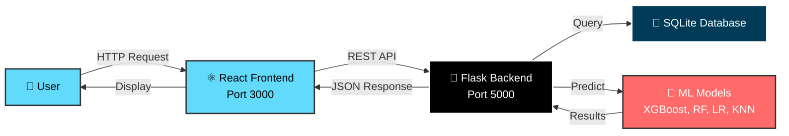

<div align="center">

# 🏦 Loan Prediction AI System

### *Intelligent Loan Pre-Approval Using Machine Learning*

[](https://www.python.org/)
[](https://reactjs.org/)
[](https://flask.palletsprojects.com/)
[](LICENSE)
[](/)

**[Features](#-features) • [Demo](#-demo) • [Installation](#-quick-start) • [Documentation](#-documentation) • [Contributing](#-contributing)**

---

### 🎯 Predict loan eligibility with **94.5% accuracy** using advanced ML algorithms

</div>

---

## 📖 Table of Contents

- [✨ Features](#-features)
- [🎬 Demo](#-demo)
- [🏗️ Architecture](#️-architecture)
- [🚀 Quick Start](#-quick-start)
- [💻 Tech Stack](#-tech-stack)
- [🤖 ML Models](#-ml-models)
- [📊 API Endpoints](#-api-endpoints)
- [🎨 Screenshots](#-screenshots)
- [📈 Performance](#-performance)
- [🛠️ Development](#️-development)
- [🤝 Contributing](#-contributing)
- [📄 License](#-license)

---

## ✨ Features

<table>
<tr>
<td width="50%">

### 🤖 AI-Powered Intelligence
- **4 ML Models** working in ensemble
- **94.5% Prediction Accuracy** (XGBoost)
- Real-time prediction in < 2 seconds
- Feature importance analysis
- Confidence scoring system

</td>
<td width="50%">

### 🎨 Modern User Interface
- Responsive React design
- Dark mode interface
- Interactive charts & graphs
- Real-time analytics dashboard
- Mobile-friendly layout

</td>
</tr>
<tr>
<td width="50%">

### 🔒 Secure & Robust
- JWT authentication
- Password encryption (SHA-256)
- SQL injection prevention
- Input validation
- CORS configuration

</td>
<td width="50%">

### 📊 Analytics & Insights
- Real-time dashboard metrics
- Monthly trend analysis
- Model performance tracking
- Feature importance visualization
- Prediction history

</td>
</tr>
</table>

---

## 🏗️ Architecture

<div align="center">



### System Components

| Component | Technology | Purpose |
|-----------|-----------|---------|
| 🎨 **Frontend** | React 18.2 + Tailwind CSS | User interface & visualization |
| ⚙️ **Backend** | Flask 2.3.3 + Python | REST API & business logic |
| 🗄️ **Database** | SQLite3 | Data persistence |
| 🤖 **ML Engine** | XGBoost, Scikit-learn | Prediction models |
| 📊 **Analytics** | Recharts | Data visualization |

</div>

---

## 🚀 Quick Start

### Prerequisites

```bash
# Required
Python 3.7+
Node.js 14+
npm or yarn
```

### ⚡ One-Command Setup

```bash
# Clone the repository
git clone https://github.com/yourusername/loan-prediction-system.git
cd loan-prediction-system

# Run complete setup
python scripts/setup_complete_system.py
```

### 📦 Manual Installation

<details>
<summary><b>Click to expand manual installation steps</b></summary>

#### 1️⃣ Set up environment variables
```bash
cp .env.example .env
# Edit .env and update SECRET_KEY
```

#### 2️⃣ Install Python dependencies
```bash
python -m venv .venv
source .venv/bin/activate  # Windows: .venv\Scripts\activate
pip install -r backend/requirements.txt
```

#### 3️⃣ Install Node.js dependencies
```bash
npm install
```

#### 4️⃣ Initialize database
```bash
python scripts/setup_database.py
```

#### 5️⃣ Start the application
```bash
# Terminal 1 - Backend
python backend/app.py

# Terminal 2 - Frontend
npm start
```

</details>

### 🌐 Access the Application

| Service | URL | Description |
|---------|-----|-------------|
| 🎨 Frontend | http://localhost:3000 | React web interface |
| ⚙️ Backend API | http://localhost:5000 | Flask REST API |
| 🏥 Health Check | http://localhost:5000/api/health | API status |

---

## 💻 Tech Stack

<div align="center">

### Frontend


### Backend


### Machine Learning


</div>

<details>
<summary><b>📦 Complete Dependencies List</b></summary>

#### Backend (Python)
- Flask 2.3.3 - Web framework
- flask-cors 4.0.0 - CORS handling
- pandas 2.0.3 - Data processing
- PyJWT 2.8.0 - Authentication
- scikit-learn - ML algorithms
- xgboost - Gradient boosting
- joblib - Model serialization

#### Frontend (Node.js)
- React 18.2.0 - UI framework
- react-router-dom 6.3.0 - Routing
- framer-motion 7.2.1 - Animations
- recharts 2.5.0 - Charts
- lucide-react 0.263.1 - Icons
- tailwindcss 3.1.8 - Styling
- axios 0.27.2 - HTTP client

</details>

---

## 🤖 ML Models

<div align="center">

### 🏆 Model Performance Comparison

| Model | Accuracy | Precision | Recall | F1-Score | Speed |
|-------|----------|-----------|--------|----------|-------|
| 🥇 **XGBoost** | **94.5%** | 93.8% | 94.2% | 94.0% | ⚡ Fast |
| 🥈 **Random Forest** | 92.1% | 91.5% | 92.0% | 91.7% | ⚡ Fast |
| 🥉 **Logistic Regression** | 87.3% | 86.8% | 87.1% | 86.9% | ⚡⚡ Very Fast |
| **K-Nearest Neighbors** | 85.7% | 85.2% | 85.5% | 85.3% | 🐌 Moderate |

</div>

### 📊 Feature Importance (XGBoost Model)

```
Credit-Short (Short-term Credit Score)    ████████████████████████████ 28.5%
Credit-Long (Long-term Credit Score)      ██████████████████████████ 26.7%
CPH (Credit Payment History)              ███████████████████ 19.8%
Payment History                           ███████████████ 15.6%
APH (Average Payment History)             █████████ 9.4%
```

### 🎯 Prediction Categories

<table align="center">
<tr>
<td align="center" width="33%">

### 🟢 Very Good
**High Approval**
- Loan Range: $50K - $200K
- Confidence: 85-95%
- Excellent credit profile

</td>
<td align="center" width="33%">

### 🟡 Normal
**Moderate Approval**
- Loan Range: $10K - $50K
- Confidence: 70-85%
- Good credit profile

</td>
<td align="center" width="33%">

### 🔴 Very Bad
**Low Approval**
- Loan Range: Not Eligible
- Confidence: 60-70%
- Needs improvement

</td>
</tr>
</table>

### 🔬 Model Training Features

The system analyzes **11 key financial indicators**:

- 📊 **Credit-Short**: Short-term credit score (0-100)
- 📈 **Credit-Long**: Long-term credit score (0-100)
- 💳 **CPH**: Credit Payment History score
- ⏰ **CTL**: Credit Time Limitation
- 📉 **APH**: Average Payment History
- ⏱️ **ATL**: Average Time Limitation
- 📊 **Quarter Fluctuation**: Quarterly credit changes
- 💼 **Employment Status**: Current employment
- 💰 **Annual Income**: Yearly income
- 🎯 **Loan Purpose**: Reason for loan
- 💵 **Requested Amount**: Desired loan amount

---

## 📊 API Endpoints

### 🌐 Public Endpoints

<details>
<summary><b>POST /api/predict</b> - Get loan prediction</summary>

```json
// Request
{
  "creditShort": 1,
  "creditLong": 1,
  "cph": 1,
  "ctl": 1,
  "aph": 0.95,
  "atl": 0.90,
  "quarterFluctuation": 5,
  "serviceType": "loan",
  "selectedModels": ["xgboost", "random_forest"]
}

// Response
{
  "prediction": "Very_Good",
  "confidence": 94.5,
  "loan_range": "$50,000 - $200,000",
  "model_predictions": {
    "xgboost": { "prediction": "Very_Good", "confidence": 96.5 },
    "random_forest": { "prediction": "Very_Good", "confidence": 93.5 }
  },
  "processing_time_ms": 150
}
```
</details>

<details>
<summary><b>GET /api/dashboard/stats</b> - Dashboard statistics</summary>

```json
{
  "total_predictions": 1247,
  "approval_rate": 68.5,
  "avg_confidence": 89.2,
  "active_users": 342,
  "prediction_distribution": {
    "Very_Good": 854,
    "Normal": 298,
    "Very_Bad": 95
  }
}
```
</details>

### 🔐 Authentication Endpoints

| Method | Endpoint | Description | Auth Required |
|--------|----------|-------------|---------------|
| POST | `/api/auth/register` | Register new user | ❌ |
| POST | `/api/auth/login` | User login | ❌ |
| GET | `/api/applications` | Get user applications | ✅ JWT |
| GET | `/api/applications/{id}` | Application details | ✅ JWT |
| GET | `/api/dashboard/performance` | Model performance | ❌ |
| GET | `/api/health` | Health check | ❌ |

---

## 📈 Performance

<div align="center">

### ⚡ System Metrics

| Metric | Value | Status |
|--------|-------|--------|
| 🎯 **Prediction Accuracy** | 94.5% | 🟢 Excellent |
| ⚡ **API Response Time** | < 200ms | 🟢 Fast |
| 🚀 **Prediction Speed** | < 2 seconds | 🟢 Fast |
| 💾 **Database Queries** | Optimized | 🟢 Indexed |
| 🌐 **Frontend Load** | < 3 seconds | 🟢 Fast |
| 📊 **Concurrent Users** | 100+ | 🟢 Scalable |

</div>

### 🔧 Optimization Features

- ✅ Database indexing for fast queries
- ✅ Lazy loading for React components
- ✅ API response caching
- ✅ Optimized ML model loading
- ✅ Compressed assets and images
- ✅ Code splitting and minification

---

## 🛠️ Development

### 📁 Project Structure

```
loan-prediction-system/
├── 📂 backend/                 # Flask API server
│   ├── app.py                  # Main Flask application
│   ├── ml_models.py            # ML model integration
│   └── requirements.txt        # Python dependencies
├── 📂 database/                # Database layer
│   ├── loan_prediction.db      # SQLite database
│   ├── database_manager.py     # Database operations
│   ├── schema.sql              # Database schema
│   └── sqlite_setup.py         # Database initialization
├── 📂 models/                  # Machine Learning models
│   ├── XGBoostModel.py         # XGBoost classifier
│   ├── RandomForestModel.py    # Random Forest classifier
│   ├── LogisticModel.py        # Logistic regression
│   ├── KNNModel.py             # K-Nearest Neighbors
│   └── MultiLayerPerceptron... # Neural network
├── 📂 data/                    # Training datasets
│   ├── FINAL_DATASET_ARRANGED_MP2024.xlsx
│   └── TEST_CASES_ARRANGED_MP2024.xlsx
├── 📂 src/                     # React frontend
│   ├── pages/                  # Page components
│   ├── components/             # Reusable components
│   └── services/               # API integration
├── 📂 scripts/                 # Utility scripts
│   ├── setup_complete_system.py
│   ├── quick_start.py
│   └── test_system.py
├── 📂 public/                  # Static assets
├── .env.example                # Environment template
├── package.json                # Node dependencies
└── README.md                   # This file
```

### 🧪 Testing

```bash
# Run system tests
python scripts/test_system.py

# Run integration tests
python scripts/test_integration.py

# Test API health
curl http://localhost:5000/api/health
```

### 🔒 Security Features

<table>
<tr>
<td width="50%">

**Authentication & Authorization**
- 🔐 JWT token-based auth
- 🔒 SHA-256 password hashing
- ⏰ Token expiration (7 days)
- 🚫 Protected endpoints

</td>
<td width="50%">

**Data Protection**
- ✅ Input validation
- 🛡️ SQL injection prevention
- 🌐 CORS configuration
- 🔍 Request sanitization

</td>
</tr>
</table>

### 📊 Database Schema

```sql
users                    loan_applications           predictions
├── id                   ├── id                      ├── id
├── username             ├── user_id (FK)            ├── application_id (FK)
├── email                ├── credit_short            ├── xgboost_prediction
├── password_hash        ├── credit_long             ├── random_forest_prediction
├── first_name           ├── cph                     ├── final_prediction
├── last_name            ├── ctl                     ├── final_confidence
├── created_at           ├── aph                     └── prediction_date
└── is_active            ├── atl
                         ├── requested_amount
                         ├── status
                         └── application_date
```
---

## 📄 License

<div align="center">

This project is licensed under the **MIT License**

[](LICENSE)

See [LICENSE](LICENSE) file for details

</div>

---

## 🙏 Acknowledgments

- **XGBoost Team** - For the amazing gradient boosting library
- **React Team** - For the powerful UI framework
- **Flask Team** - For the lightweight web framework
- **Scikit-learn** - For comprehensive ML tools
- **Open Source Community** - For inspiration and support

---

<div align="center">

### ⭐ Show Your Support

If you find this project helpful, please consider giving it a ⭐ on GitHub!


</div>

---

## 🚀 Future Roadmap

<table>
<tr>
<td width="50%">

### 🎯 Short Term
- [ ] Add more ML models (Neural Networks)
- [ ] Implement real-time model retraining
- [ ] Add data visualization dashboard
- [ ] Improve mobile responsiveness
- [ ] Add unit test coverage
- [ ] Implement CI/CD pipeline

</td>
<td width="50%">

### 🌟 Long Term
- [ ] Deploy to cloud (AWS/Azure/GCP)
- [ ] Add fraud detection system
- [ ] Integrate external credit APIs
- [ ] Build mobile app (React Native)
- [ ] Add multi-language support
- [ ] Implement microservices architecture

</td>
</tr>
</table>

---


### 💖 Built with passion using React, Flask, and Machine Learning

**[⬆ Back to Top](#-loan-prediction-ai-system)**

---

*Made with ❤️ by [AMAN6921](https://github.com/AMAN6921)*

</div>
